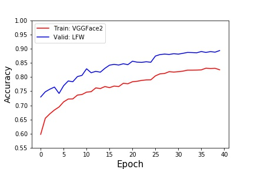
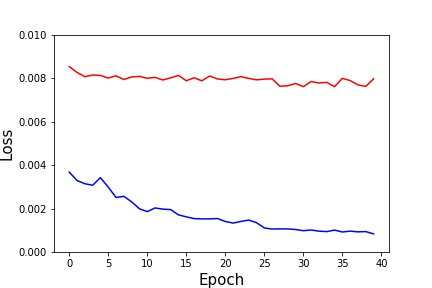
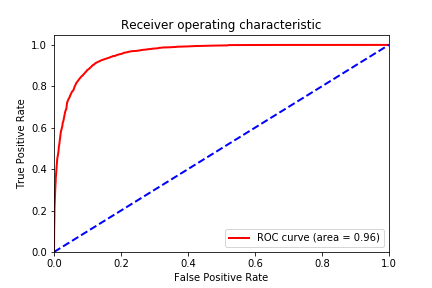

# Facenet for face recognition using pytorch
- Pytorch implementation of the paper: "FaceNet: A Unified Embedding for Face Recognition and Clustering".
- Training of network is done using triplet loss.

# How to train/validate model
- Download vggface2 (for training) and lfw (for validation) datasets.
  - https://www.robots.ox.ac.uk/%7Evgg/data/vgg_face2/
  - http://vis-www.cs.umass.edu/lfw/lfw.tgz

- Align face image files by following David Sandberg's instruction (part of "Face alignment").
  - https://github.com/davidsandberg/facenet/wiki/Classifier-training-of-inception-resnet-v1

- Write list file of face images by running "datasets/write_csv_for_making_dataset.ipynb" 
  - This is aready in the directory of datasets so that you don't need to do again if you are urgent.
  - To run this one need to modify paths in accordance with location of image dataset.
  
- Train
  - Again, one need to modify paths in accordance with location of image dataset.
  - Also feel free to change some parameters.
  
  
# Results

- Accuracy on VGGFace2 and LFW datasets

- Triplet loss on VGGFace2 and LFW datasets

- ROC curve on LFW datasets for validation

# References
- https://github.com/liorshk/facenet_pytorch 
- https://github.com/davidsandberg/facenet
- https://arxiv.org/abs/1503.03832
